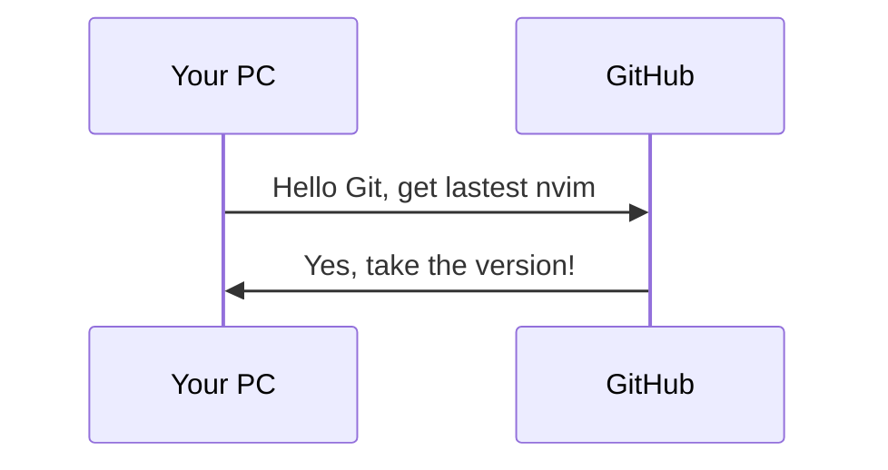

# This script is return last verion of Neovim



## Usage 
```
$ ./version.py
0.10.0
```

## Requirements
- [Python3](https://www.python.org/)
- [Requsts](https://pypi.org/project/requests/)
- [re](https://docs.python.org/3/library/re.html) (built-in module)
You can install requests with pip
```
pip install requests
```
## Version 
0.0.1 


